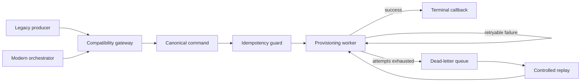

# Legacy Provisioning Migration

A practical Strangler-pattern case study for migrating a critical provisioning consumer without a big-bang cutover.

The service accepts legacy and modern message envelopes, normalizes both into one domain command and keeps terminal status visible through callbacks, bounded retries and a replayable dead-letter queue.

## The problem

Replacing a critical integration in one release creates unnecessary operational risk. Producers and consumers rarely migrate at the same pace, and an untracked failure can leave the upstream orchestrator waiting forever.

This project demonstrates a safer transition:



## What it demonstrates

- Dual-read compatibility during migration
- A canonical internal contract isolated from transport formats
- Feature-controlled migration modes: `legacy-only`, `dual-read`, `modern-only`
- Idempotent processing for duplicate queue deliveries
- Bounded retry with deterministic demo scenarios
- Terminal success/failure callbacks
- Dead-letter inspection and controlled replay
- Automated tests and secret scanning

## Run locally

```bash
npm install
npm run dev
```

The API runs at `http://localhost:3002`.

Send a modern message:

```bash
curl -X POST http://localhost:3002/v1/messages \
  -H "content-type: application/json" \
  -d '{"schemaVersion":"2026-01","execution":{"id":"exec-demo-001","correlationId":"corr-demo-001"},"command":{"action":"ACTIVATE","subscriberRef":"subscriber-1001","provider":"provider-alpha"}}'
```

Send a legacy message that reaches the DLQ:

```bash
curl -X POST http://localhost:3002/v1/messages \
  -H "content-type: application/json" \
  -d '{"schemaVersion":"legacy","jobId":"legacy-demo-002","action":"BLOCK","subscriber":"subscriber-2002","destination":"provider-beta","demo":{"failuresBeforeSuccess":5}}'
```

Inspect the migration:

- `GET /v1/executions`
- `GET /v1/callbacks`
- `GET /v1/dead-letters`
- `POST /v1/dead-letters/:executionId/replay`

## Migration strategy

1. **Legacy only:** baseline existing behavior and add observability.
2. **Dual read:** accept both envelopes and compare terminal outcomes.
3. **Progressive routing:** move producers independently behind a feature control.
4. **Modern only:** reject new legacy traffic after the migration window.
5. **Retirement:** remove the compatibility adapter after the rollback period.

See [ADR 001](docs/adr/001-strangler-migration.md) for the trade-offs.

## License

MIT.
